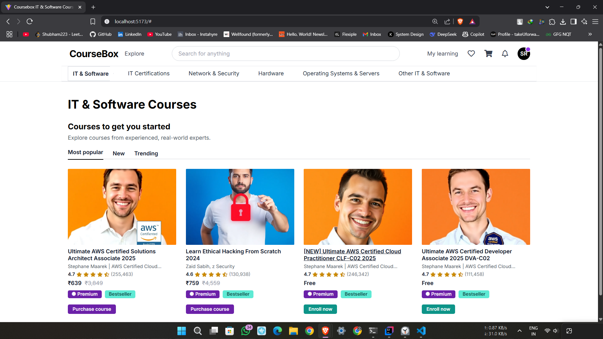
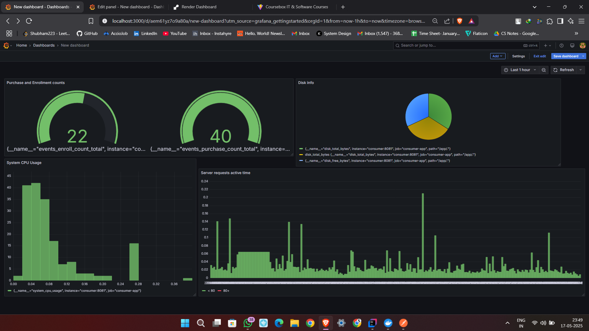

# 📊 Analytics Manager – Website Event Monitoring System

A real-time analytics system to monitor user actions like course enrollments, purchases, and registrations using Kafka, Spring Boot, Prometheus, Grafana, and MySQL.

---

## 🌟 Features

- ⚡ Track events like enroll, purchase, and register in real time
- 🧵 Event-driven architecture using Kafka
- 🎯 Microservices-based backend (Producer & Consumer)
- 💾 Stores event data in MySQL
- 📈 Exposes metrics to Prometheus
- 📊 Grafana dashboard to visualize trends
- 🖥️ Frontend React app for user interactions

---

## 🧱 Project Structure (Git Branches)

| Branch      | Description                          |
|-------------|--------------------------------------|
| `frontend`  | React app for users to trigger events |
| `producer`  | Spring Boot producer sends events to Kafka |
| `consumer`  | Spring Boot consumer processes events, saves to DB, and exposes metrics |

---

## 🖼️ Screenshots


| Frontend                              | Grafana Dashboard                   |
|---------------------------------------|-------------------------------------|
|  |  |

---

## 🔧 Tech Stack

- **React** – Frontend interface
- **Spring Boot** – Java backend
- **Apache Kafka** – Event streaming
- **MySQL** – Relational database
- **Prometheus** – Metrics collection
- **Grafana** – Visualization
- **Micrometer** – Metric export
- **Docker Compose** – Local orchestration

---

## 🚀 Setup Instructions

### 🛠️ Prerequisites

- Java 17+
- Node.js & npm (for react)
- Docker & Docker Compose
- Git

---

### 🧬 Clone and Run the Project

```bash
git clone https://github.com/your-username/analytics-manager.git
cd analytics-manager
```

---

### ⚙️ Run Everything at once

#### 🔵 Run docker compose from the root folder

```bash
git checkout main
cd analytics-manager
docker-compose up --build
```

## OR

### ⚙️ Run Each Component

#### 🔵 Producer Service (Spring Boot – Port `8080`)

```bash
git checkout producer
cd analytics-producer
./gradlew bootRun
```

#### 🟡 Consumer Service (Spring Boot – Port `8081`)

```bash
cd ..
git checkout consumer
cd analytics-consumer
./gradlew bootRun
```

#### 🟢 Frontend (React – Port `5173`)

```bash
cd ..
git checkout frontend
cd analytics-frontend
npm install
npm start
```

> The React app will be available at: http://localhost:5173

---

### 🐳 Start Kafka, Prometheus, Grafana, MySQL

```bash
cd analytics-consumer
docker-compose up --build
```

---

## 🎯 How It Works

1. **User** clicks a button in the React app (enroll, purchase, etc.)
2. A **POST request** is sent to the `producer` backend
3. **Producer** sends event to Kafka topic `course-events`
4. **Consumer** listens to the topic, parses event
5. Event is:
    - Saved to **MySQL**
    - Sent as metric to **Prometheus**
6. **Grafana** visualizes metrics in real time

---

## 📤 Sample Event Payload

```json
{
  "courseId": "c456",
  "eventType": "enroll"
}
```

---

## 📊 Prometheus Metrics Example

```
event_enroll_total{courseId="c456"} 17
event_purchase_total{courseId="c123"} 4
```

---

## 🔍 Monitoring Tools

| Tool        | URL                       | Default Login        |
|-------------|---------------------------|-----------------------|
| Prometheus  | http://localhost:9090     | –                     |
| Grafana     | http://localhost:3000     | admin / admin         |
| MySQL       | localhost:3306            | analytics_user / pass |

---

## 🧪 How to Test

- Trigger events from the frontend or using curl
- View metrics in Prometheus or Grafana
- Verify DB rows using MySQL client

---

---

## 👨‍💻 Author

Built by [Shubham Raut](https://github.com/ShubhamRaut280)

---

## 📜 License

MIT License – feel free to use, modify, and share.
